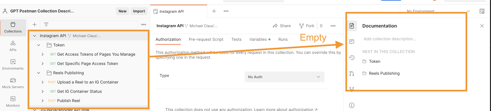
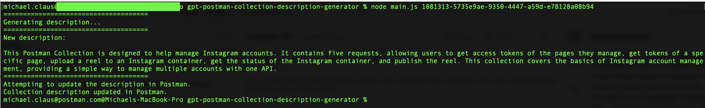
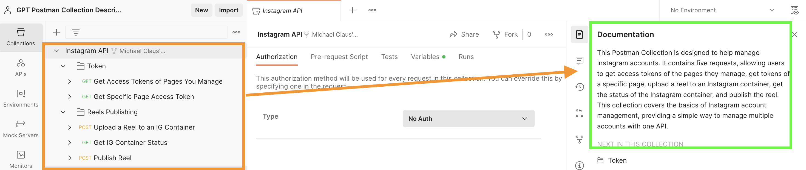
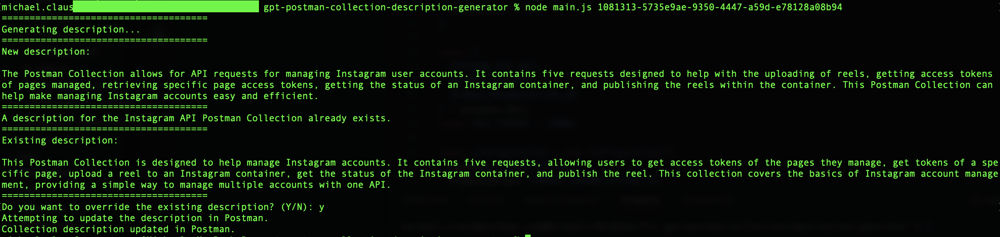
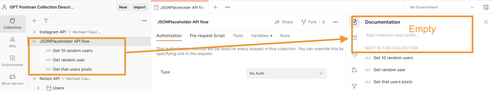
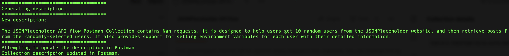
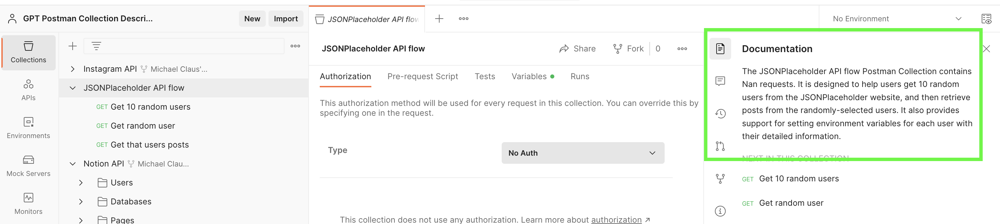
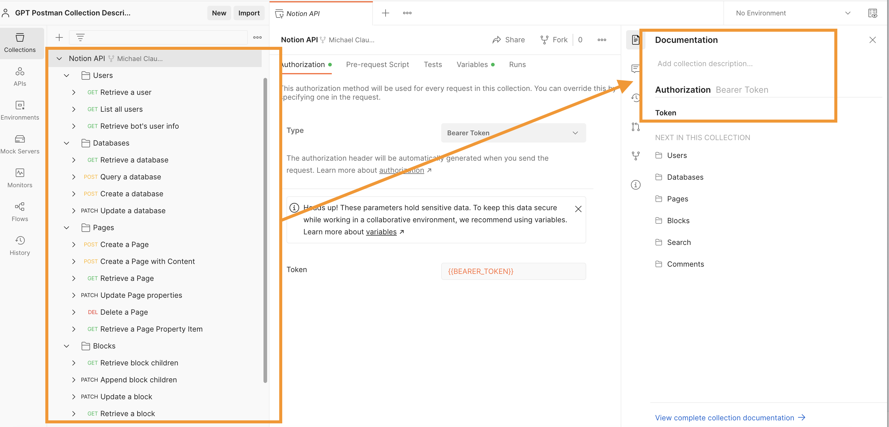
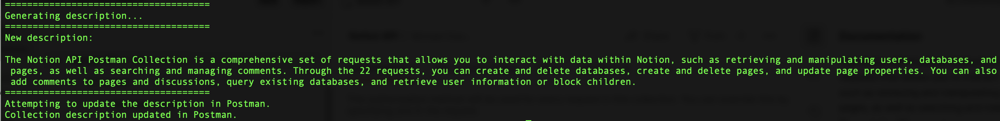
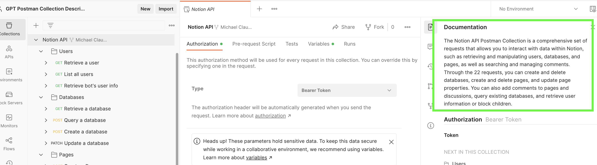

# GPT Postman Collection Description Generator
- By Michael J. Claus

This script generates and updates a human-readable description for a Postman Collection using the OpenAI API, based on the collection ID provided as a command-line argument.

How it works is you provide a Postman Collection ID as a command-line argument, and the script will use the Postman API to retrieve the collection's name and the names of all of its folders and requests.  It takes into account each requests name, endpoint, HTTP Method, and any pre-reqeuest script, post-request test script, and description if they are included. It will then use the OpenAI API to generate a description for the collection based on the collection name and the names of all of its folders and requests. The script will then ask you whether you want to update the existing description in Postman or not. Type \`Y\` to update the description or \`N\` to exit without updating.

A few key takeaways:
- Working with the OpenAI API is surprisingly easy and straight forward!
- Getting the prompt just right is tricky and takes lots of iteration, experimentation and tweaking.
- Generating prompts consumes OpenAI Tokens, which you pay for.  This is something to be mindful of when using the OpenAI API.  It may be a good idea to include a token limit in the prompt generation if your collection has a lot of requests.

## Quick Start

1. Clone down the repo and `cd` into the root of the directory.
2. Run `npm install`.  
3. Add a `.env` file containing values for `POSTMAN_API_KEY=your_key` `OPENAI_API_KEY=your_key` and `OPENAI_ORGANIZATION_ID=your_org-id` (you can get these from your Postman and OpenAI accounts).
4. Run `node main.js <collection_id>` where `<collection_id>` is the ID of the Postman collection you want to generate a description for.

## Example

### Demo #1

[Instagram Collection]('https://www.postman.com/meta/workspace/instagram/collection/23987686-9386f468-7714-490f-9bfc-9442db5c8f00?ctx=documentation') (I forked the collection and cleared the description so it would generate a new one).
Before:

During:

After:

Note: If a description already exists for the collection, it will generate a new one and ask if you want to overwrite the existing description.

### Demo #2

[JSONPlaceholder]('https://jsonplaceholder.typicode.com/') Collection (I created this collection and added some requests to it).
Before:

During:

After:

### Demo #3

[Notion Collection]('https://www.postman.com/notionhq/workspace/notion-s-api-workspace/collection/15568543-d990f9b7-98d3-47d3-9131-4866ab9c6df2?ctx=documentation') (I forked the collection and cleared the description so it would generate a new one).
Before:

During:

After:

## Prerequisites

- Node.js installed on your system
- Postman API Key
- OpenAI API Key and Organization ID

## Installation

1. Clone the repository:

`git clone https://github.com/your-username/postman-collection-description-generator.git`

2. Navigate to the project directory:

`cd postman-collection-description-generator`

3. Install the required dependencies:

`npm install`

4. Create a `.env` file in the root directory of the project and add your Postman API Key, OpenAI API Key, and OpenAI Organization ID:

`POSTMAN_API_KEY=your_postman_api_key`
`OPENAI_API_KEY=your_openai_api_key`
`OPENAI_ORGANIZATION_ID=your_openai_organization_id`

## Usage

Run the script with the collection ID as the first argument:

`node main.js <collection_id>`

Example:

`node main.js 1081313-c3297b5a-b24e-405b-830e-005d457aa738`

The script will generate a new description for the specified Postman Collection and ask you whether you want to update the existing description in Postman or not. Type \`Y\` to update the description or \`N\` to exit without updating.

## License

This project is licensed under the MIT License. See the [LICENSE](LICENSE) file for details.
